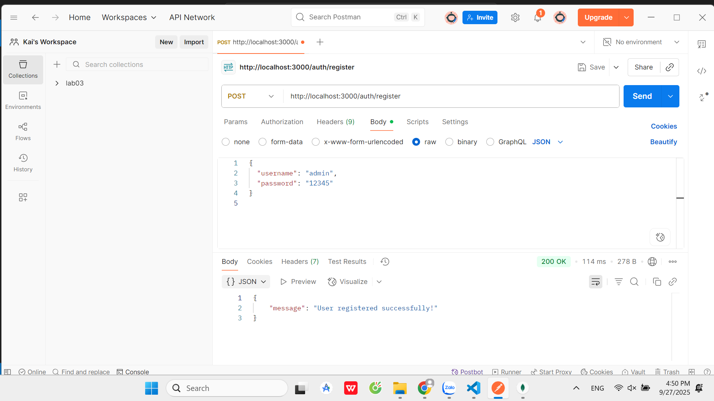
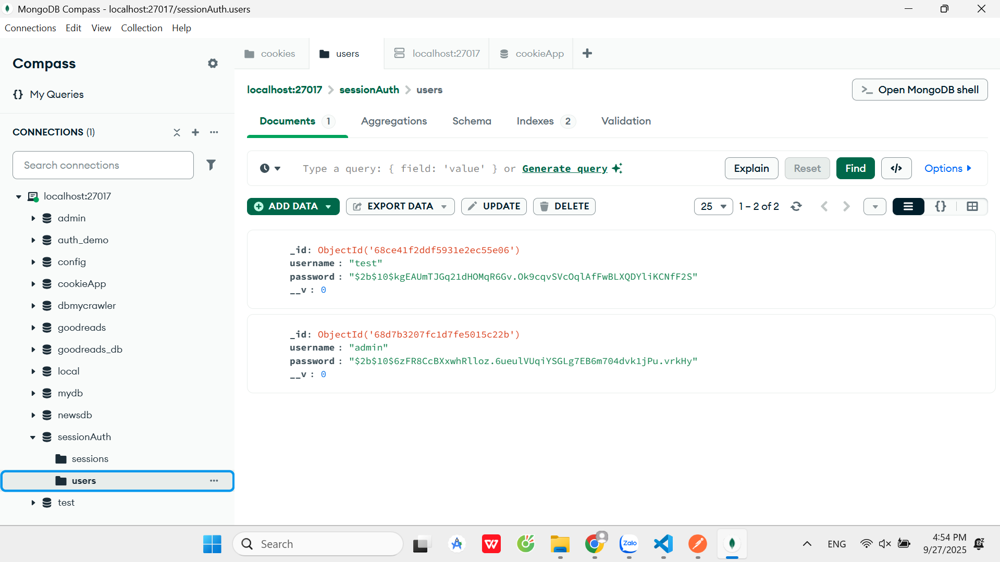
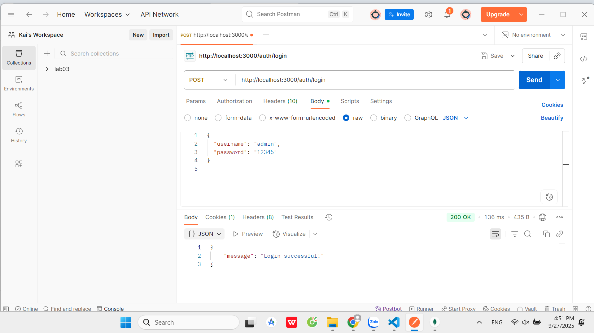
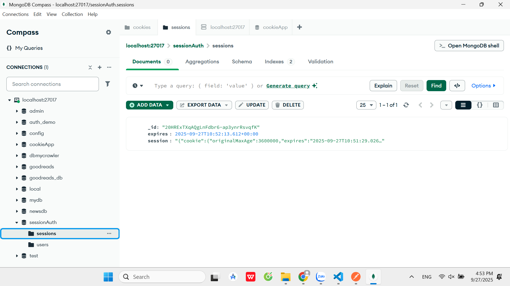
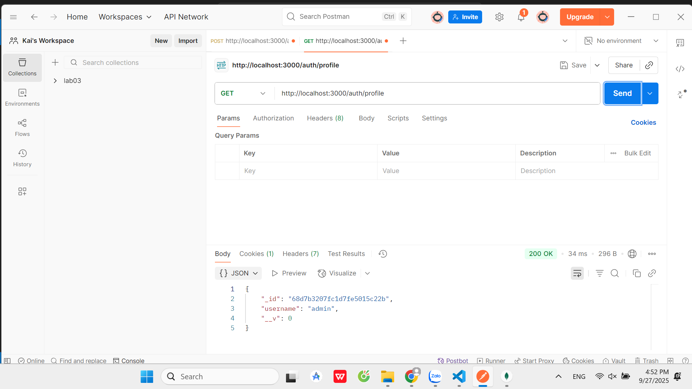
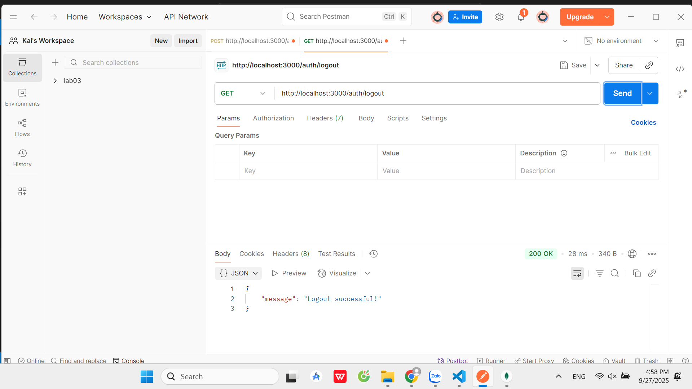
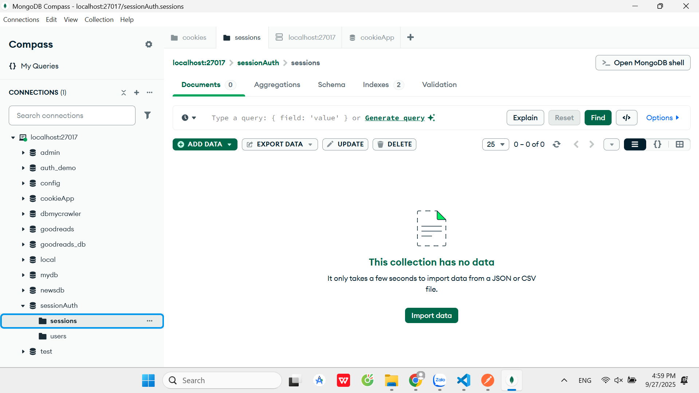
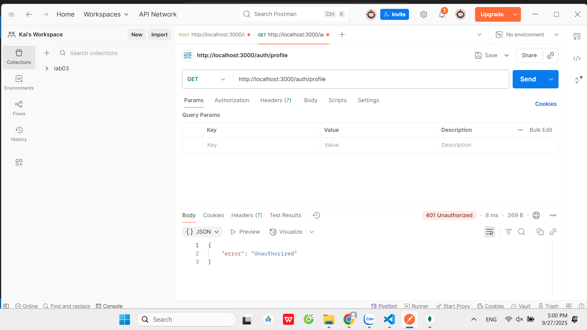

# Test cookie_session_auth

1. Gửi request:  
POST http://localhost:3000/auth/register
Body: `username=admin, password=12345`  

2. Gửi request:  
POST http://localhost:3000/auth/login 
Body: `username=admin, password=12345`  

3. Gửi request:  
GET http://localhost:3000/auth/profile

4. Gửi request:  
GET http://localhost:3000/auth/logout
 
Kiểm tra lại trong DB → session đã bị xoá:  

5. Truy cập profile sau khi logout:  
GET http://localhost:3000/auth/profile
